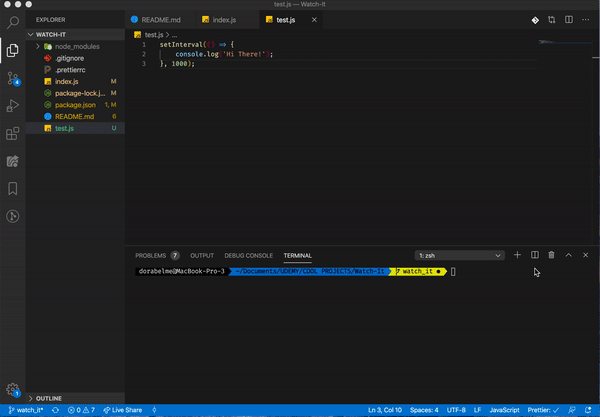

# Watch It!

Nodemon Command Line Tool built using Node.js and different packages.

## Short demo:

## Tech Stack and Dependencies

-   Node.js
-   Caporal ^1.3.0
-   Chalk ^4.0.0
-   Chokidar ^3.3.1
-   Lodash.debounce ^4.0.8

## Installation

1. `git clone git@github.com:dorabelme/Watch-It.git`
2. Run `npm install` to get dependencies for the project
3. Run `watchit [filename]`, optional command line argument
